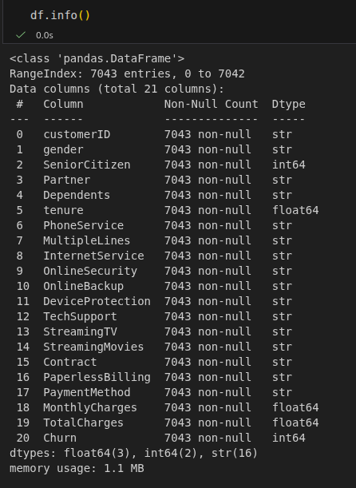
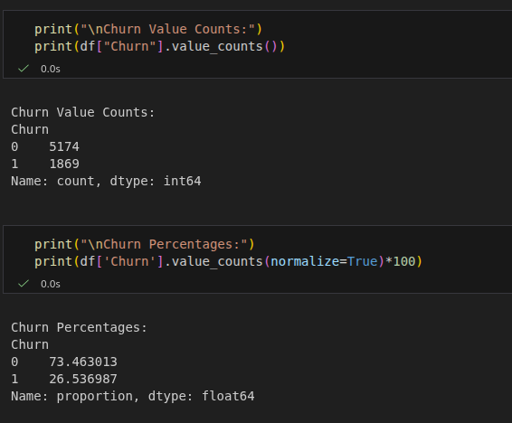
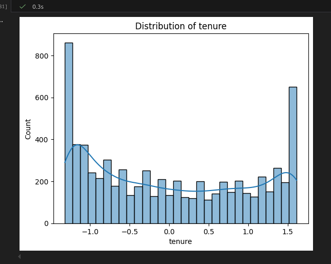
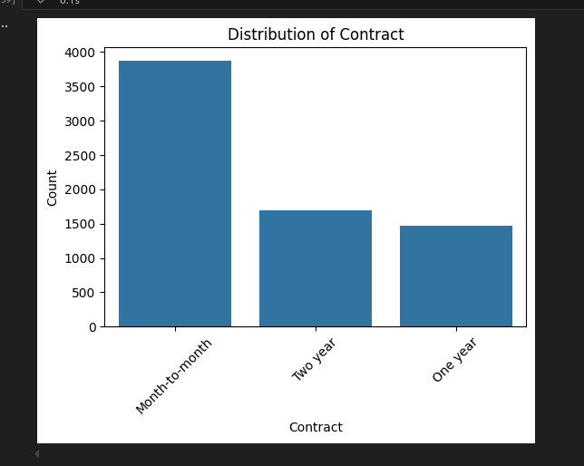
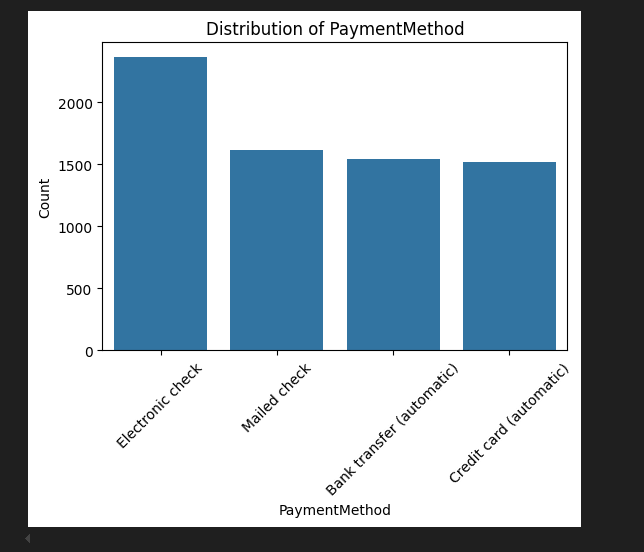
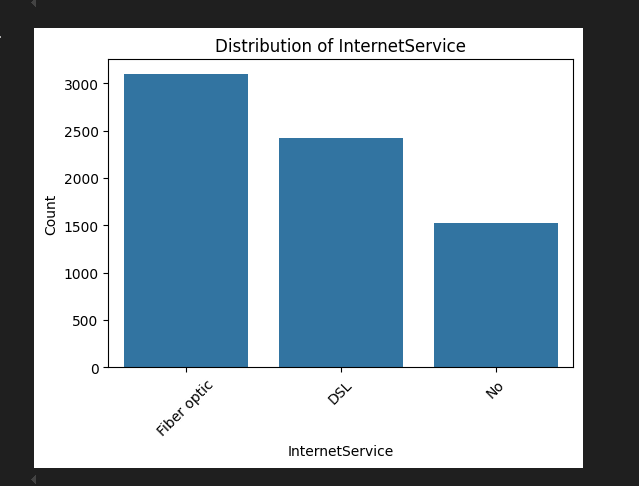
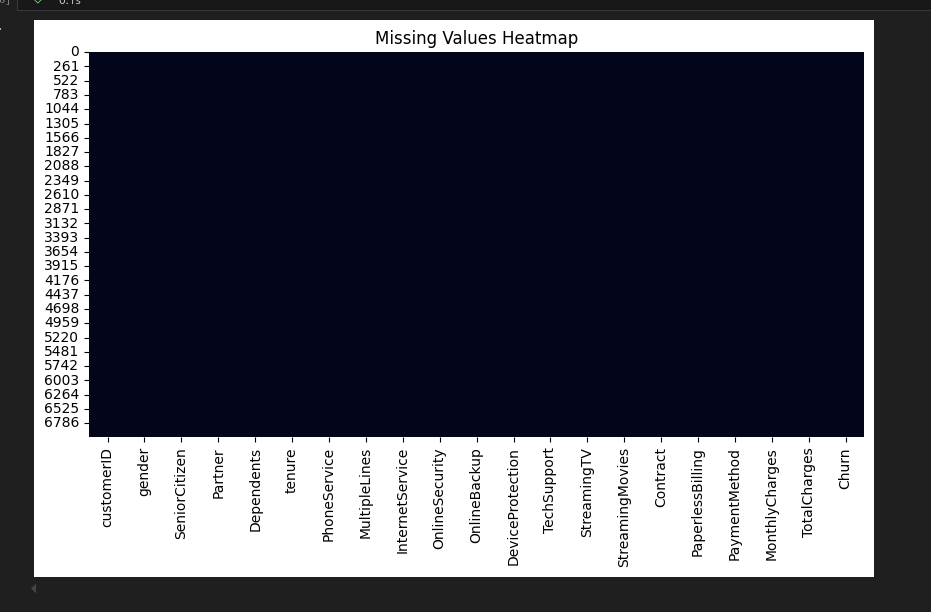
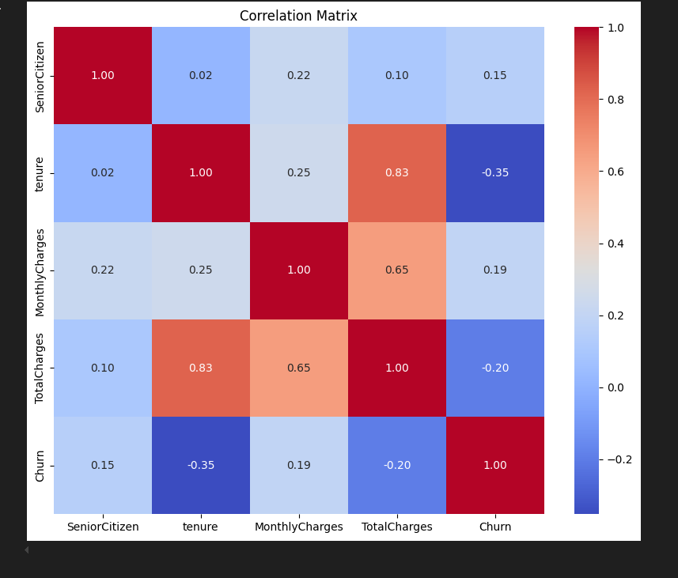

# DATA-REPORT.md — Day 1 (Telco Customer Churn)

## 1. Dataset Overview
- **Rows:** 7043  
- **Columns:** 21  
- **Numeric columns:** tenure, MonthlyCharges, TotalCharges, SeniorCitizen, Churn  
- **Categorical columns:** 16 columns including gender, Partner, Dependents, InternetService, etc.  
- **Missing values:** None after cleaning  

**Screenshot:**  

  

---

## 2. Target Variable Distribution (`Churn`)
- `0` = No churn  
- `1` = Churn  

**Observations:**  
- Majority of customers did not churn  
- Dataset is slightly imbalanced  

**Screenshot:**  

  

---

## 3. Numeric Feature Distributions
- **Columns:** tenure, MonthlyCharges, TotalCharges  
- Observed distributions:  
  - tenure slightly skewed  
  - MonthlyCharges roughly uniform  
  - TotalCharges skewed due to customers with short tenure  

**Screenshots:** 

- Histogram of tenure:

   

- Histogram of MonthlyCharges: 

  

- Histogram of TotalCharges: 

  

---

## 4. Categorical Feature Distributions
- Features like Contract, PaymentMethod, InternetService show variations in customer behavior  
- Most common contract: Month-to-month  
- Most common payment method: Electronic check  

**Screenshots:**  
- Contract distribution:   
- PaymentMethod distribution:   
- InternetService distribution:   

---

## 5. Missing Values Heatmap
- No missing values remain in the cleaned dataset  

**Screenshot:**  
  

---

## 6. Correlation Matrix (Numeric Features)
- Positive correlation observed between tenure and TotalCharges  
- MonthlyCharges weakly correlated with TotalCharges  
- Target variable Churn weakly correlated with numeric features  

**Screenshot:**  
  

---

## 7. Summary
- Dataset is cleaned: duplicates removed, TotalCharges converted, missing values handled  
- Basic EDA performed: distributions, correlations, and missing value checks  
- Dataset ready for next steps (feature engineering, scaling, train/test split)
