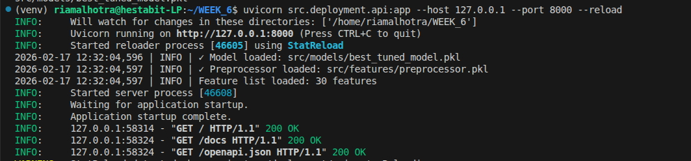
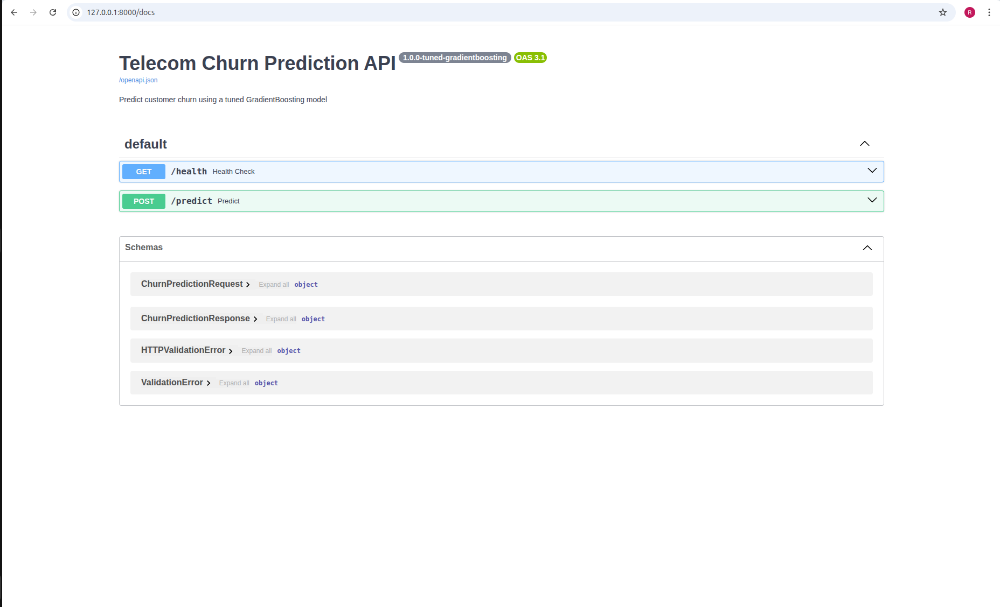
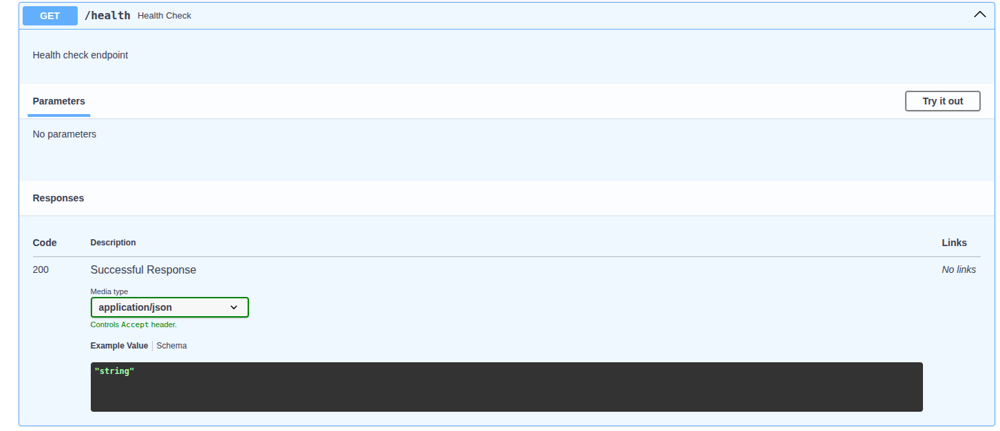
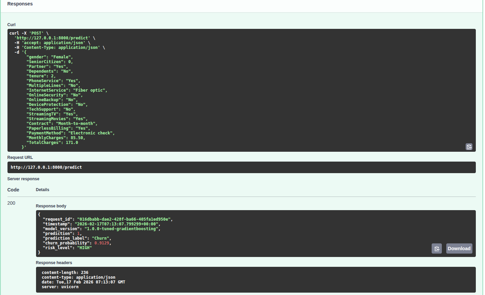
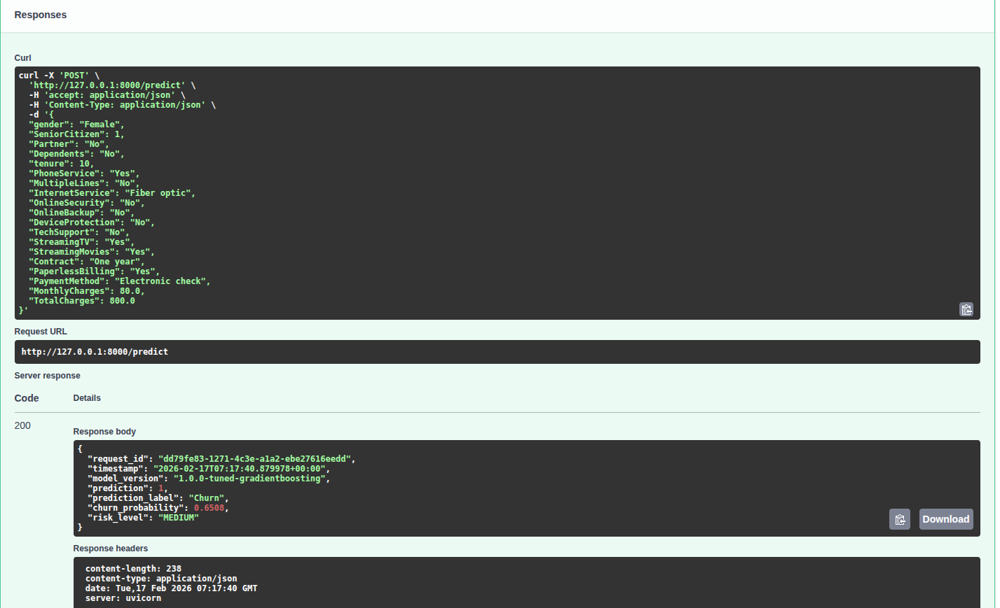

# Deployment Notes

## Overview
**Model**: Tuned GradientBoosting Classifier  
**API**: FastAPI + Uvicorn  
**Version**: 1.0.0-tuned-gradientboosting

---

## Setup

### 1. Install Dependencies
```bash
pip install -r requirements.txt
```

### 2. Configure Environment
```bash
cp .env.example .env
```

### 3. Verify Required Files
```bash
ls src/models/best_tuned_model.pkl
ls src/features/preprocessor.pkl
ls src/features/feature_list.json
```

---

## Running the API
```bash
uvicorn src.deployment.api:app --host 127.0.0.1 --port 8000 --reload
```

### API Endpoints (Swagger UI)
```
http://localhost:8000/docs
```

| Endpoint | Method | Description |
|----------|--------|-------------|
| `/health` | GET | Health check |
| `/predict` | POST | Predict churn |

---

## Testing

### Health Check
```bash
curl http://localhost:8000/health
```

### Predict (High Risk Customer)
```bash
curl -X POST "http://localhost:8000/predict" \
     -H "Content-Type: application/json" \
     -d '{
       "gender": "Female",
       "SeniorCitizen": 0,
       "Partner": "Yes",
       "Dependents": "No",
       "tenure": 2,
       "PhoneService": "Yes",
       "MultipleLines": "No",
       "InternetService": "Fiber optic",
       "OnlineSecurity": "No",
       "OnlineBackup": "No",
       "DeviceProtection": "No",
       "TechSupport": "No",
       "StreamingTV": "Yes",
       "StreamingMovies": "Yes",
       "Contract": "Month-to-month",
       "PaperlessBilling": "Yes",
       "PaymentMethod": "Electronic check",
       "MonthlyCharges": 85.50,
       "TotalCharges": 171.0
     }'
```


## Prediction Response
```json
{
  "request_id": "uuid",
  "timestamp": "2026-02-17T06:28:13+00:00",
  "model_version": "1.0.0-tuned-gradientboosting",
  "prediction": 1,
  "prediction_label": "Churn",
  "churn_probability": 0.9129,
  "risk_level": "HIGH"
}
```
---

## Screenshots

### 1. API Server Terminal Output


### 2. Swagger UI


### 3. Health Check Response


### 4. Predict - HIGH Risk Customer (Churn)


### 5. Predict - LOW Risk Customer (No Churn)


### 6. Predict - MEDIUM Risk Customer


---


### Risk Levels

| Probability | Risk Level |
|-------------|------------|
| ≥ 0.75 | HIGH |
| 0.50 - 0.74 | MEDIUM |
| 0.25 - 0.49 | LOW |
| < 0.25 | VERY LOW |

---

## Monitoring
```bash
python src/monitoring/drift_checker.py
```

Output saved to: `src/monitoring/drift_report.json`

---

## Docker

### Build

docker build -f src/deployment/Dockerfile -t churn-api .

### Run
docker run -p 8000:8000 churn-api

---