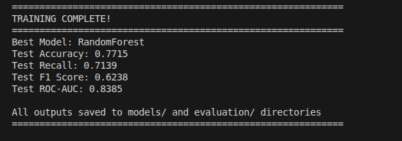
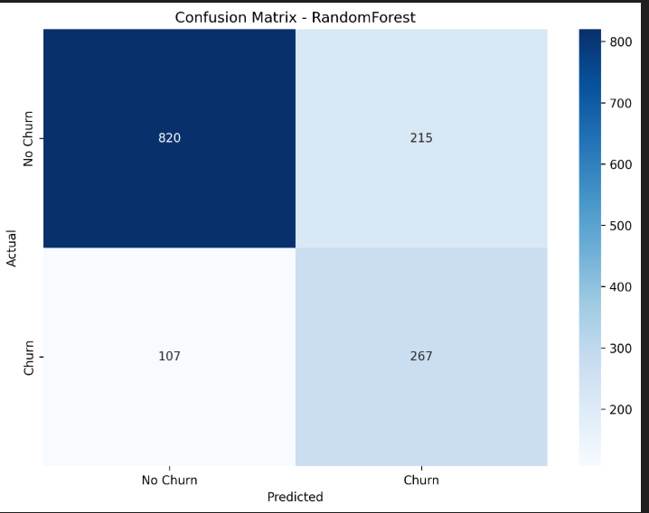

# Model Comparison Report
## Telecom Customer Churn Prediction

**Date:** Generated from Day-3 Training Pipeline  
**Dataset:** Telecom Customer Churn (7,043 customers)  
**Class Distribution:** 73.5% No Churn (0) | 26.5% Churn (1)  
**Train/Test Split:** 80/20 stratified split

---

## Model Comparison

- RandomForest: Best overall - optimal precision/recall balance
- LogisticRegression: Highest recall (79%) but lowest precision (51%) - too many false alarms
- GradientBoosting: Middle performer - no standout strengths
- SVC: Significantly underperforms - not suitable

## Executive Summary

**Best Model Selected:** **RandomForest Classifier**  
**Selection Criteria:** F1 Score (balances precision and recall for imbalanced dataset)  
**Key Achievement:** 71.4% recall - catching 71% of customers who will churn  

**Business Impact:**
- Out of 374 actual churners in test set, the model correctly identifies **267 customers** (71.4%)
- Only **107 churners are missed** (28.6% false negative rate)
- Retention team can proactively target 482 at-risk customers (267 TP + 215 FP)

---

## Model Performance Comparison

### Cross-Validation Results (5-Fold)

| Model | CV Accuracy | Std Dev | Ranking |
|-------|-------------|---------|---------|
| RandomForest | 77.80% | ±1.09% | 1st |
| GradientBoosting | 76.36% | ±1.11% | 2nd |
| LogisticRegression | 74.88% | ±1.51% | 3rd |
| SVC | 66.06% | ±0.41% | 4th |

**Observations:**
- Low standard deviation across all models indicates stable performance
- RandomForest shows best generalization during cross-validation
- SVC significantly underperforms compared to ensemble methods

---

### Test Set Performance (All Metrics)

| Model | Accuracy | Precision | Recall | F1 Score | ROC-AUC |
|-------|----------|-----------|--------|----------|---------|
| **RandomForest** | **77.15%** | **55.39%** | **71.39%** | **62.38%** | **83.85%** |
| LogisticRegression | 73.95% | 50.60% | 79.14% | 61.73% | 84.13% |
| GradientBoosting | 74.88% | 51.88% | 73.80% | 60.93% | 83.39% |
| SVC | 66.78% | 41.26% | 59.36% | 48.68% | 73.39% |

---

## Terminal Output

## Confusion Matrix

