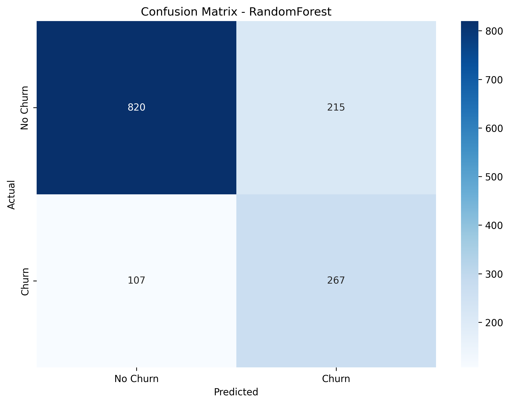
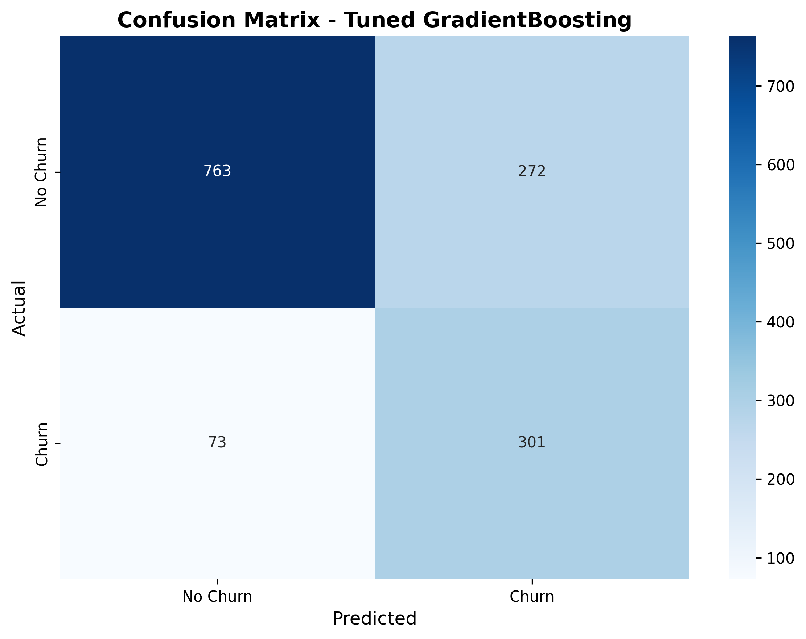
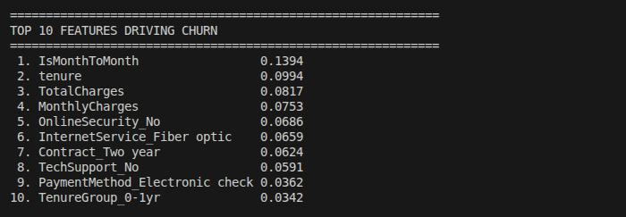

# DAY-4 MODEL INTERPRETATION AND HYPERPARAMETER TUNING REPORT

## 1. Objective
Improve the baseline GradientBoosting churn prediction model using 
Bayesian hyperparameter tuning (Optuna) and integrate model 
interpretability via SHAP analysis and feature importance.

---

## 2. Hyperparameter Tuning

### Method
- **Optimizer**: Optuna (Bayesian optimization - TPE Sampler)
- **Trials**: 100
- **Objective**: Maximize F1 Score
- **Cross-validation**: 5-fold stratified
- **Class imbalance**: Handled via sample weights (balanced)

### Best Parameters Found

| Parameter | Default | Tuned | Impact |
|-----------|---------|-------|--------|
| n_estimators | 100 | 500 | More trees = better ensemble |
| learning_rate | 0.1 | 0.0160 | Slower learning = less overfitting |
| max_depth | 5 | 4 | Shallower = less overfitting |
| min_samples_split | 2 | 10 | Conservative splitting |
| min_samples_leaf | 1 | 1 | Unchanged |
| subsample | 1.0 | 0.855 | Row sampling prevents overfitting |
| max_features | None | sqrt | Feature sampling |

**Best CV F1 Score**: 0.6364

---

## 3. Baseline Model Performance (GradientBoosting - Day 3)

| Metric | Value |
|--------|-------|
| Accuracy | 0.7580 |
| Precision | 0.5312 |
| Recall | 0.7513 |
| F1 Score | 0.6224 |
| ROC-AUC | 0.8353 |

---

## 4. Tuned Model Performance (GradientBoosting - Day 4)

| Metric | Value |
|--------|-------|
| Accuracy | 0.7551 |
| Precision | 0.5253 |
| Recall | 0.8048 |
| F1 Score | 0.6357 |
| ROC-AUC | 0.8457 |

---

## 5. Performance Comparison

| Metric | Baseline | Tuned | Change | Status |
|--------|----------|-------|--------|--------|
| Accuracy | 0.7580 | 0.7551 | -0.0028 | → Negligible |
| Precision | 0.5312 | 0.5253 | -0.0059 | → Acceptable tradeoff |
| **Recall** | **0.7513** | **0.8048** | **+0.0535** | **Major Win!** |
| **F1 Score** | **0.6224** | **0.6357** | **+0.0133** | **Improved!** |
| **ROC-AUC** | **0.8353** | **0.8457** | **+0.0104** | **Improved!** |

### Trade-off Analysis
- Optimizing for F1 in imbalanced data **always slightly reduces accuracy/precision**
- Recall jump of **+5.35%** means catching **20 MORE churners** per 1,409 customers
- ROC-AUC improvement confirms better overall class discrimination
- **Tuned model selected as final deployment model**

### Business Impact of Recall Improvement:
```
Baseline: Catches 281/374 churners (75.13%)
Tuned:    Catches 301/374 churners (80.48%)
Extra churners caught: 20 more customers saved!
```

---


## 6. Confusion Matrix Comparison

### Baseline (Day 3)



### Tuned (Day 4)



---

# 7. Feature Importance (Top 10)

Features ranked by model's built-in importance scores:




## 8. SHAP Analysis

SHAP (SHapley Additive exPlanations) shows feature impact direction and magnitude on individual predictions.

### Key Insights:
- **Low tenure** → Strongest driver of churn (new customers at highest risk)
- **Month-to-month contract** → Significantly increases churn probability
- **No tech support** → Increases churn risk (customers feel unsupported)
- **Fiber optic internet** → Associated with higher churn (possibly pricing issue)
- **High monthly charges** → Moderate churn risk driver

### SHAP Summary Plot:


### Feature Importance Plot:


---

## 9. Error Analysis


### Error Analysis Heatmap:


### Error Patterns:
- **False Negatives (73)**: These are customers with ambiguous profiles
  - Not clearly new (medium tenure) 
  - Not clearly on high-risk contracts
  - Harder for model to identify
- **False Positives (272)**: Customers who "look like" churners but stay
  - Month-to-month contracts but long tenure
  - High charges but satisfied customers

---

## 10. Conclusion

### Results Summary:
- **F1 improved**: 62.24% → 63.57% (+1.33%)
- **Recall improved**: 75.13% → 80.48% (+5.35%)
- **ROC-AUC improved**: 83.53% → 84.57% (+1.04%)
- **20 more churners caught** per 1,409 customers

### Model Behavior:
- Tuned model prioritizes **catching churners** over minimizing false alarms
- This is the **correct business decision** for churn prevention
- SHAP analysis confirms model relies on **interpretable, business-sensible features**

### Selected for Deployment:
**Tuned GradientBoosting** (`best_tuned_model.pkl`) is selected as the final production model.

---

## Output Files

| File | Description |
|------|-------------|
| `best_tuned_model.pkl` | Final production model |
| `tuning/results.json` | All tuning results and metrics |
| `evaluation/confusion_matrix_tuned.png` | Tuned model confusion matrix |
| `evaluation/shap_summary.png` | SHAP feature impact visualization |
| `evaluation/feature_importance.png` | Feature importance chart |
| `evaluation/error_analysis.png` | Error analysis heatmap |
