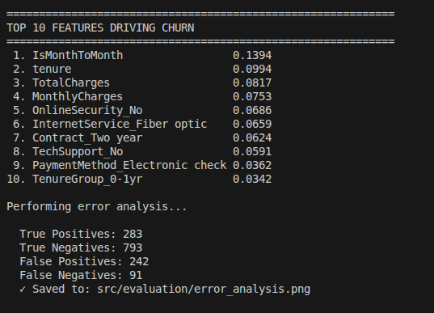
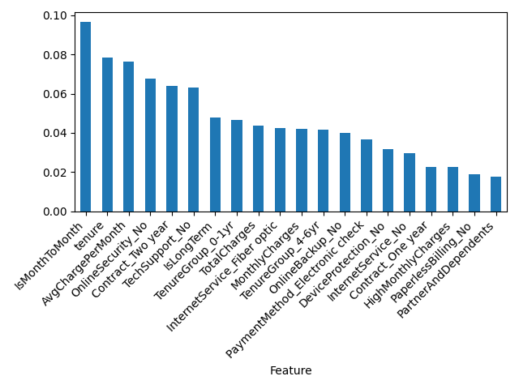
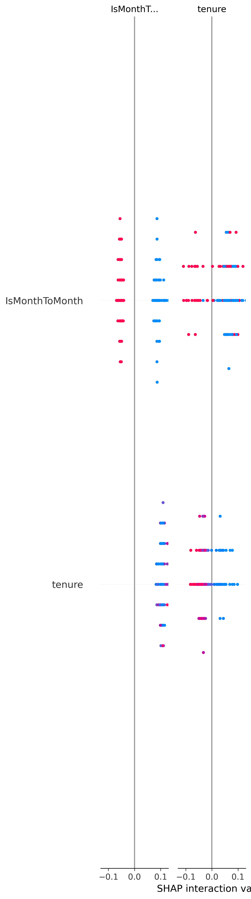
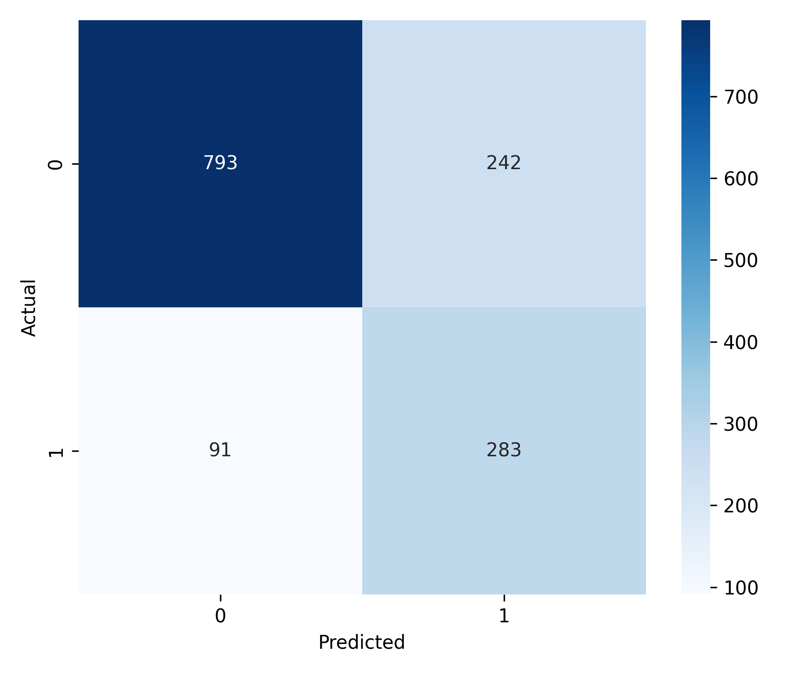

# DAY-4 MODEL INTERPRETATION AND HYPERPARAMETER TUNING REPORT

## 1. Objective

The objective of this phase was to improve the baseline churn prediction model using hyperparameter tuning and to integrate model interpretability techniques. The evaluation focuses on measurable performance improvements and understanding feature influence on model predictions.

---

## 2. Hyperparameter Tuning

Hyperparameter tuning was performed using cross-validation with F1-score as the optimization metric. Since churn prediction is an imbalanced classification problem, F1-score was selected to balance precision and recall.

The tuned model achieved a best cross-validation F1-score of 0.6361.

---

## 3. Baseline Model Performance

Accuracy: 0.7715
Precision: 0.5539
Recall: 0.7139
F1-score: 0.6238
ROC-AUC: 0.8385

---

## 4. Tuned Model Performance

Accuracy: 0.7637
Precision: 0.5390
Recall: 0.7567
F1-score: 0.6296
ROC-AUC: 0.8428

---

## 5. Performance Comparison and Trade-off Analysis

The tuned model shows improvement in key evaluation metrics:

* F1-score increased from 0.6238 to 0.6296
* Recall improved from 0.7139 to 0.7567
* ROC-AUC improved from 0.8385 to 0.8428

There is a slight decrease in accuracy and precision. This trade-off is expected when optimizing for F1-score in an imbalanced dataset. The improvement in recall indicates that the tuned model identifies a higher proportion of actual churn cases. The increase in ROC-AUC confirms improved overall class discrimination capability.

Based on these results, the tuned model is selected as the final model.

---

## 6. Top 10 Features Driving Churn

The following features were identified as the most important according to model feature importance analysis:

These features represent the strongest contributors to the model’s churn predictions.

---

## 7. Explainability Integration

Model interpretability was enhanced using:

* Feature importance analysis

* SHAP summary visualization

* Error analysis

Feature importance identifies the most influential predictors in the model. SHAP analysis provides insight into the magnitude and direction of feature impact on predictions. Error analysis helps identify patterns in misclassification and areas for further improvement.

---

## 8. Conclusion

Hyperparameter tuning resulted in improved F1-score, recall, and ROC-AUC compared to the baseline model. Although accuracy decreased slightly, the overall performance in detecting churn cases improved. The tuned model demonstrates better balance between precision and recall and improved class discrimination capability. Feature importance and SHAP analysis provide transparency into model behavior. The tuned model is selected as the final candidate for deployment.
